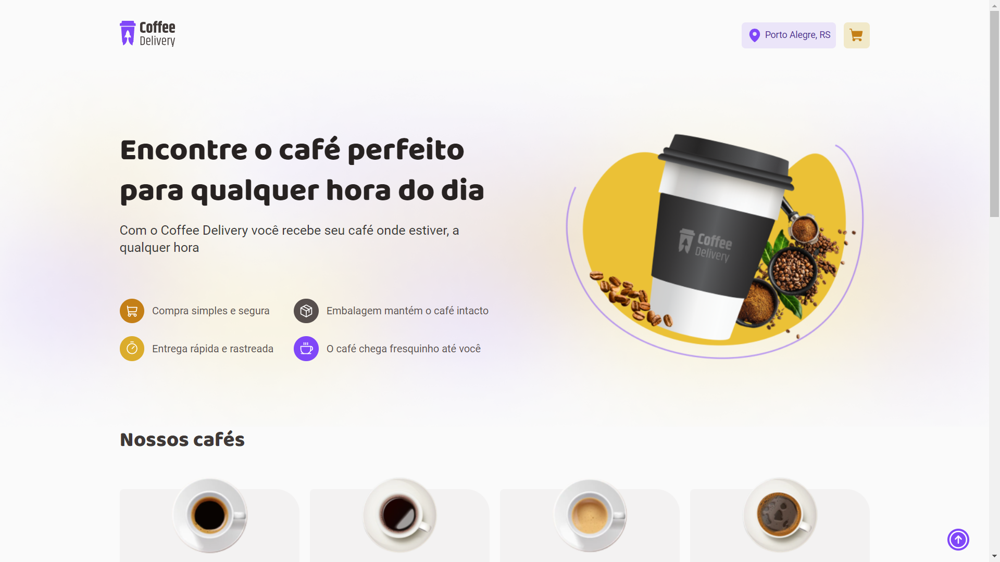
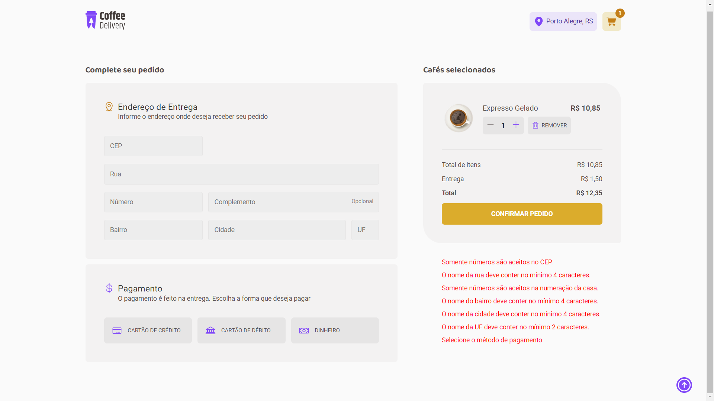
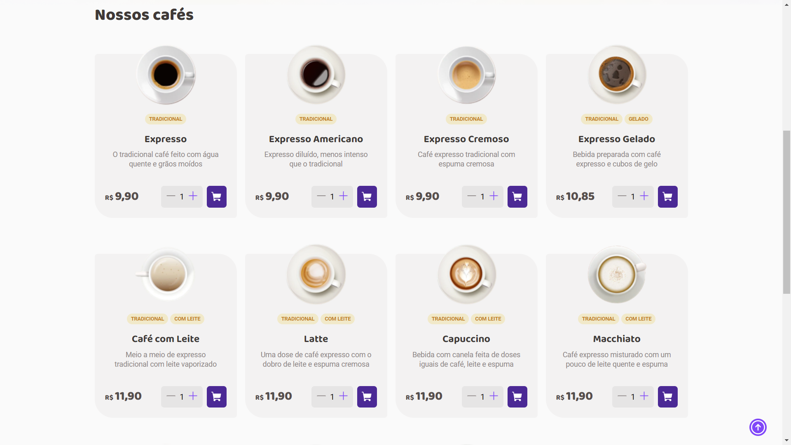

# Coffee-Delivery - Rocketseat  🚀

Project created with the help of vite in React.ts was developed during the second
challenge of Rocketseat's ignite course. The main purpose of this challenge is to train
the subjects covered during the course, such as: routes, forms, data sharing, stylized
elements, etc. The application is a small coffee delivery website, where the user has the
possibility to choose 14 varieties of coffees, after which he must fill out a small form with
data such as address and payment method. If everything is correct with the data filled
in, a new window will show final information about the delivery and payment method
chosen and the waiting time to receive the order placed.

To try this project, [click here](https://coffee-delivery-mzrz7jb0v-rrssddookk-gmailcom.vercel.app/).

 

## 🖱️ Some actions available

* 🛒Add a new item to shopping cart.
* 🗑 Remove item from shopping cart.
* ➕ Increase amount of coffee
* ➖ Decrease amount of coffee

 

### ⚠ Warning!!!

There is a limit of 20 items for every coffee option available, so the maximum amount of
coffee that the user can buy is 280 items in total.

 

## ⛔ Validations

The validations were made through the zod library where the following criterion was
used:
Zipcode ⇒ Only numbers are accepted, it must have at least 8 numeric characters.
Street ⇒ Minimum 4 characters, maximum 40 characters.
Home Number ⇒ Only numbers are accepted.
Complement ⇒ Optional field.
District ⇒ Minimum 4 characters, maximum 30 characters.
City ⇒ Minimum 4 characters, maximum 25 characters.
UF ⇒ Minimum 2 characters.
Payment Method ⇒ A payment method must be selected (Credit/Debit Card or
Cash)

Note: the order will not be confirmed unless all fields are completed correctly.

## 🛠  Tools used in project development:

* Node
* Vite
* React
* Typescript
* Phosphor Icons
* React Hook Form

